# How to deploy a project on Render?

## Create an account

1. Visit [Render's homepage](https://www.render.com) and click on the "GET STARTED" button on the top right.

2. You may choose to sign in using one of the SSO options or create an account using any email ID of yours.

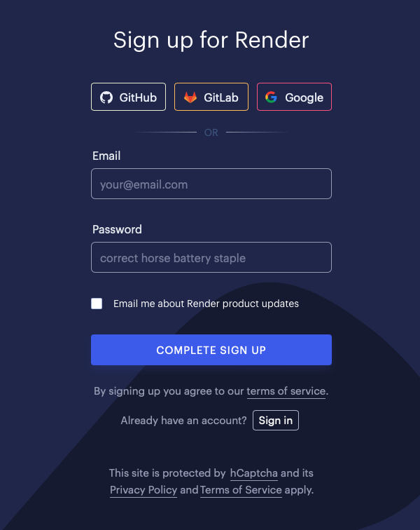

3. Once your account is successfully created, Render will redirect you to the [Dashboard](https://dashboard.render.com)

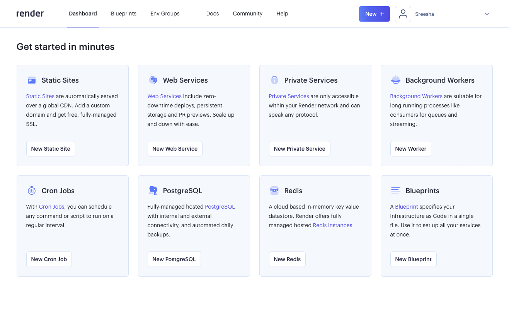

## Create an app - Web server

1. Click on the "New +" button on the top right on the Dashboard.

2. From the dropdown, select the "Web Service" option.

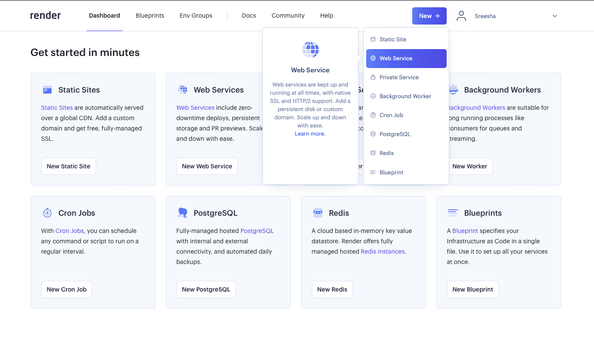

3. Select the "Build an deploy from a Git repository". We'll be deploying our application from an existing code base we've created. If you do not have a pre-built project, you can fork [this repository](https://github.com/CU-CSCI3308-Fall2023/3308-render-demo) and learn to deploy to Render. 

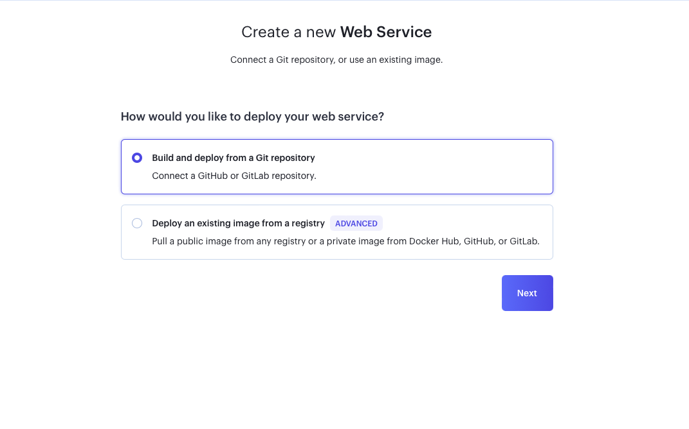

4. You can choose to connect to GitHub or GitLab. In my example, I have connected to GitHub. Alternately, you could copy and paste the link to the Git repository.

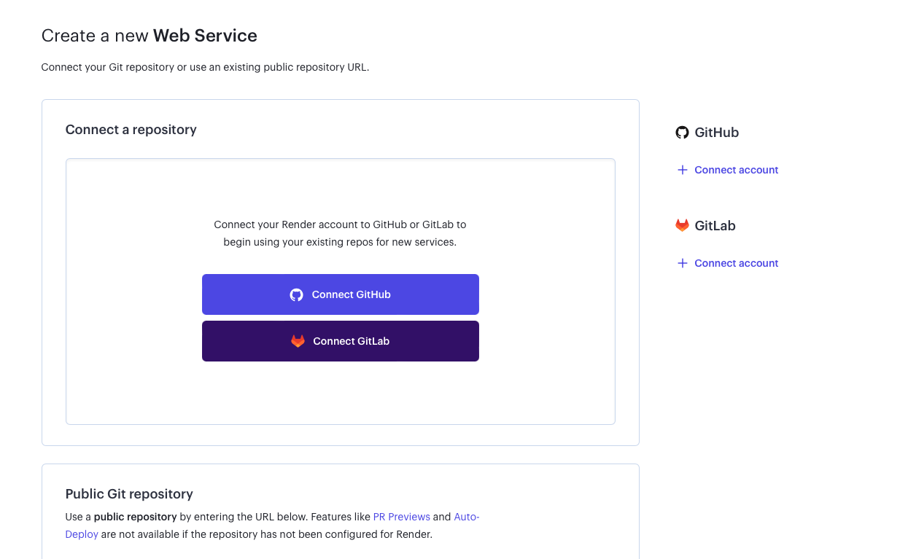

5. There are different levels of access you may provide to Render. In the screenshot below, you will see that we are giving restricted access to select repositories.

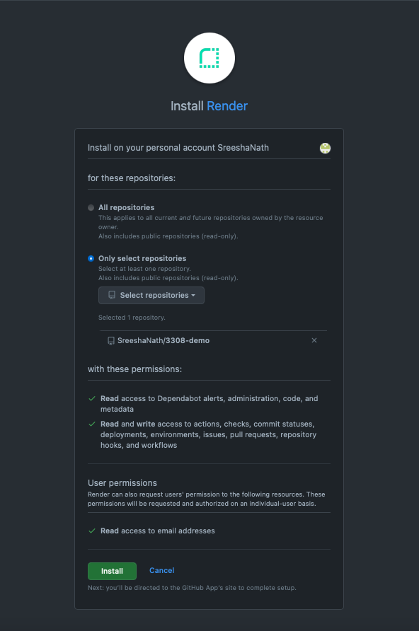

6. All the repositories you provided access to in the previous step, will show up in Render. Click on the "Connect" button next to the repository you would like to use for this tutorial.

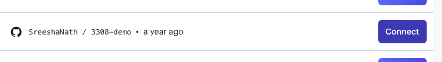

7. Now fill out the details in the form as shown below. Modify the details as needed. Since my original repository is a couple of years old, the branch is called "master". On the newer repositories, this branch is called "main". Make sure to update that on the form.

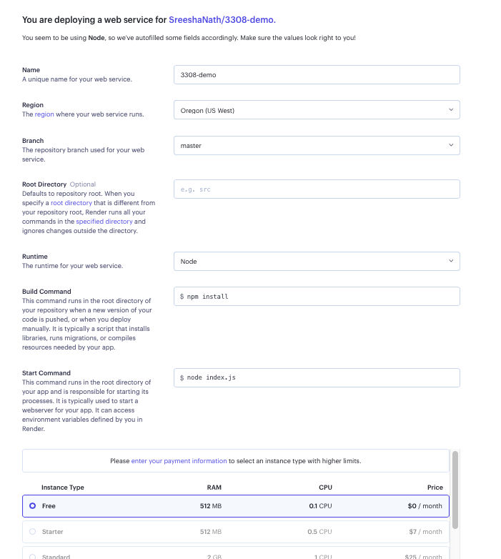

8. Once the form is filled out, scroll to the very bottom and click on "Create Web Service".

9. You will now see an app on your Dashboard.

## Create an app - PostgreSQL

1. 1. Click on the "New +" button on the top right on the Dashboard.

2. From the dropdown, select the "PostgreSQL" option.

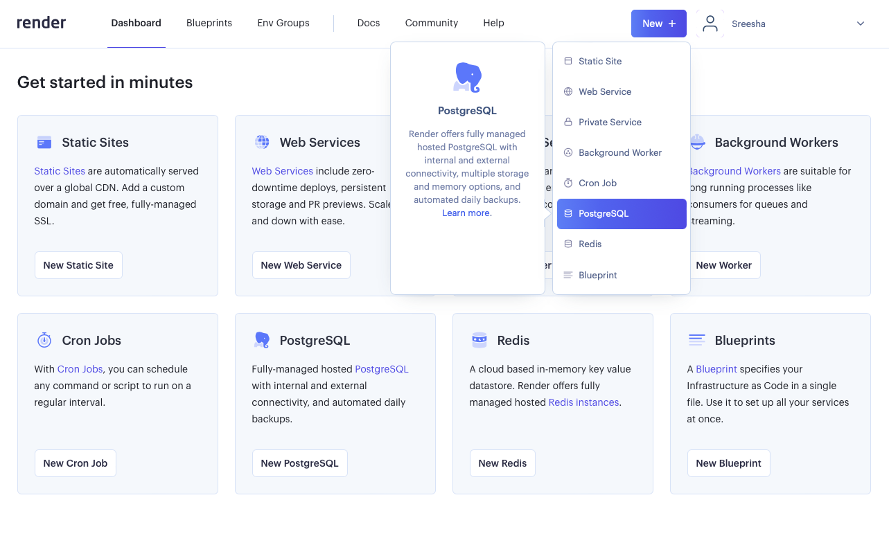

3. Fill the form as shown or modify details as needed.

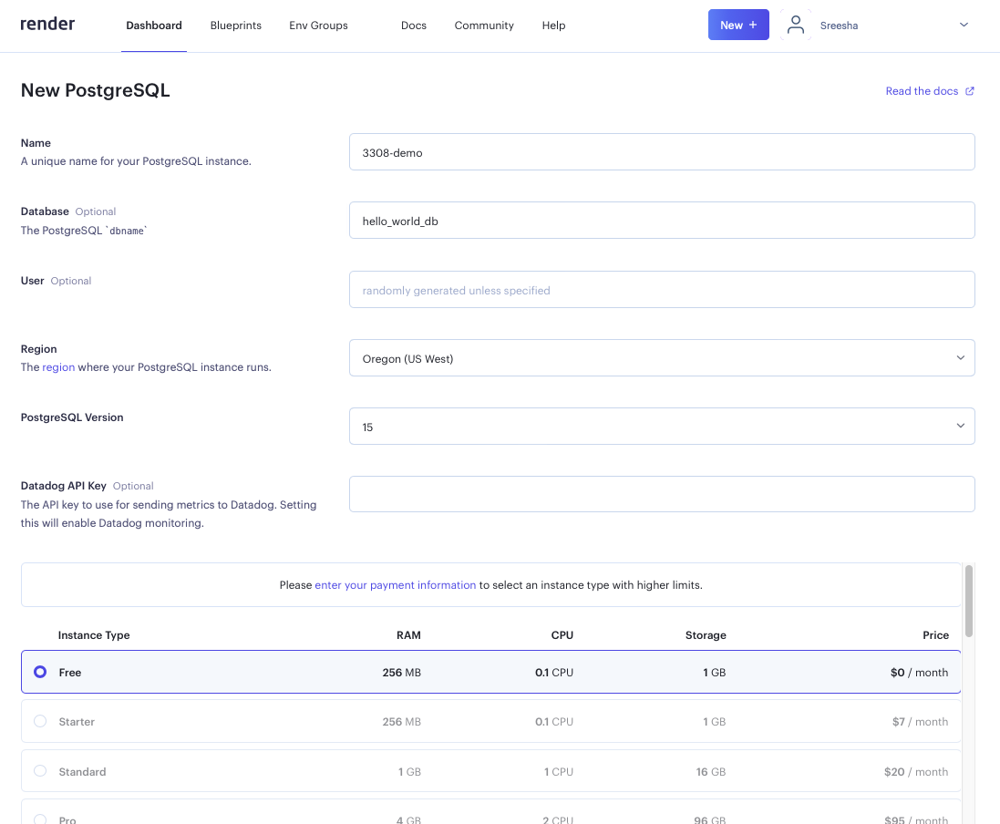

4. Scroll to the very bottom and click on "Create Database" to create the Database on Render.

5. In a couple of seconds, the database server should be ready to use. In the meantime, we will link the database service to the web service we created earlier.

## Linking Web service to PostgreSQL

1. Go to the Dashboard and click on the Web Service app.

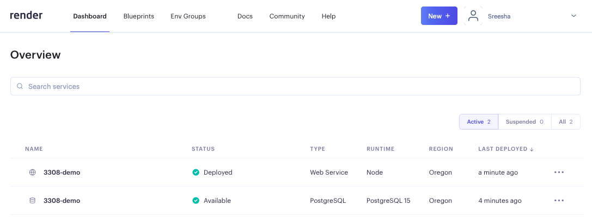

2. Click on the "Enviroment" tab in the left sidebar.

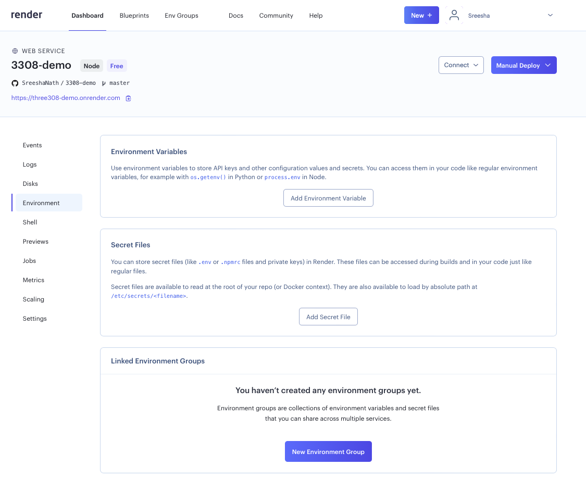

3. We will now add environment variables that will help us link the PostgreSQL service to the web service. 

    i. First, open up a new browser tab and open up the database app from the Render Dashboard and scroll down to the "Connections" section.

    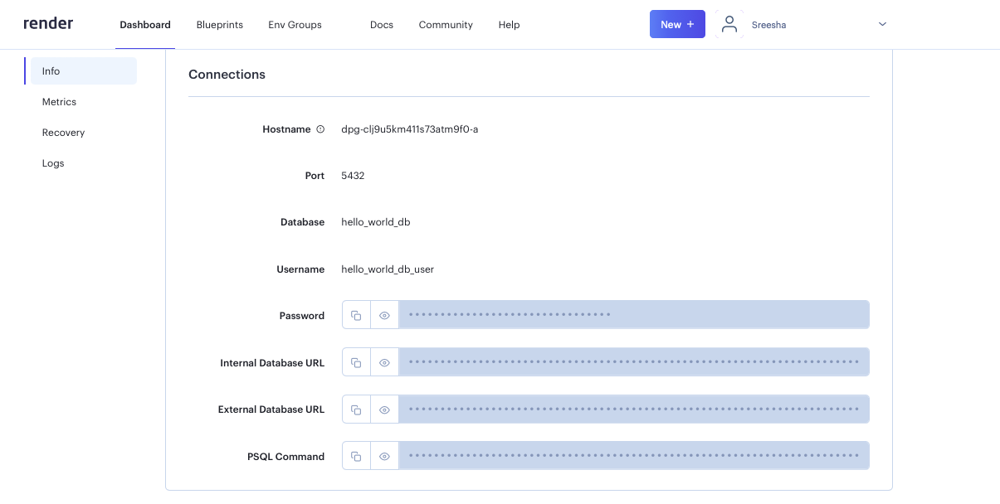

    ii. Go to the tab on your browser that has the Web Service details open. Let's add some Environment Variables.

    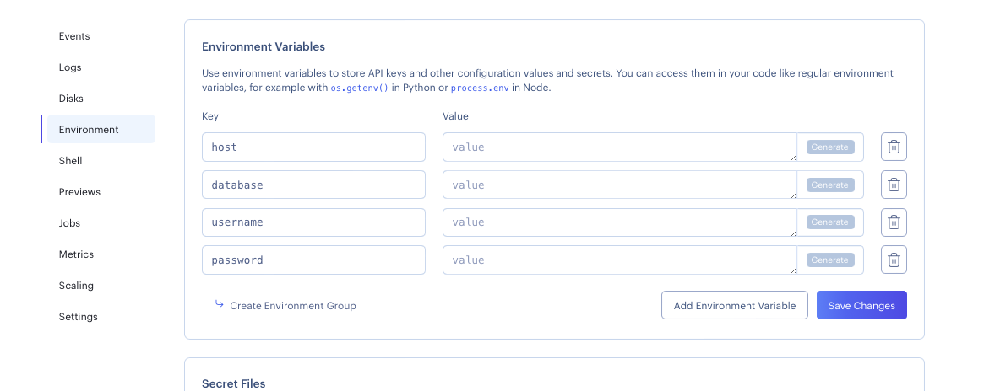

    iii. We will populate values from the PostgreSQl service. Match the values based on the names. See below for reference.

    **host**

    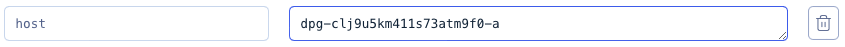

    **database**

    

    **username**

    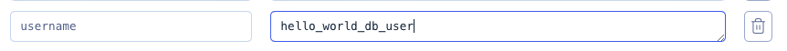

    **password**

    

## Populating the PostgreSQL database on Render using Command Line

1. You will need to install [PostgreSQL](https://www.postgresql.org/download/) locally. You may want to restart your computer once you've successfully installed PostgreSQL.

2. Once that is done, go to the PostgreSQL service page on the browser and click on the "Connect" button.

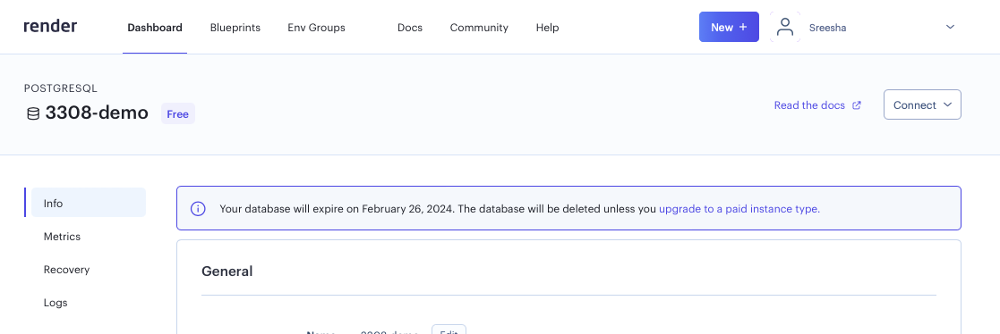

3. Click on the "External Connection" tab.

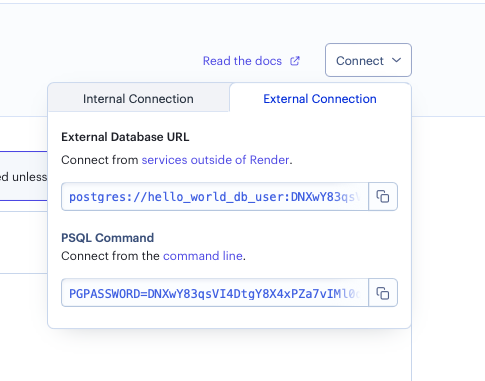

4. Copy the PSQL command and paste it in the terminal and hit enter. I will not include a screenshot of it as it contains the password to the database.

5. After the connection is successful, you will see a prompt showing the database.

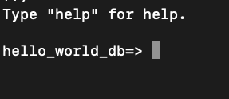

6. You can run all the DDL and DML commands from the SQL files in your project. That data is persisted in the database on Render. Once you are done, it is safe to close the terminal.

## Modifying the server file to update the database connection

1. Open your server file. In this case it is the __index.js__ file.

2. Update the `dbConfig` as can be seen in the image below.

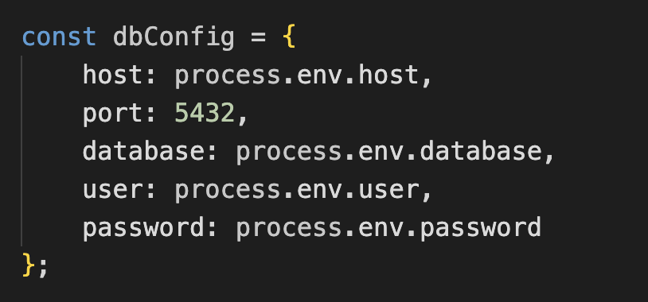

3. Commit and push your changes to your repository. This should initiate a new deployment on Render.

## Viewing your Web app

1. On your web service app page, you will find a link at the top to your web service. Clicking on that link will help you view your web app.

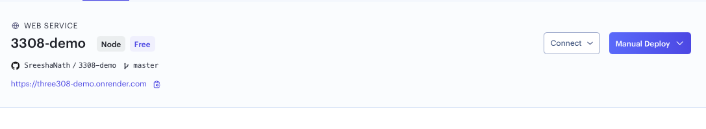

In case your web service is not automatically deployed when new code is pushed to your repository, you can click on the "Manual Deploy" button.

#### You have now successfully deployed your node application.

